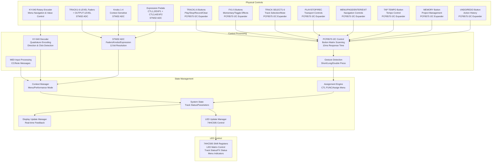
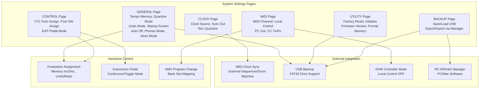
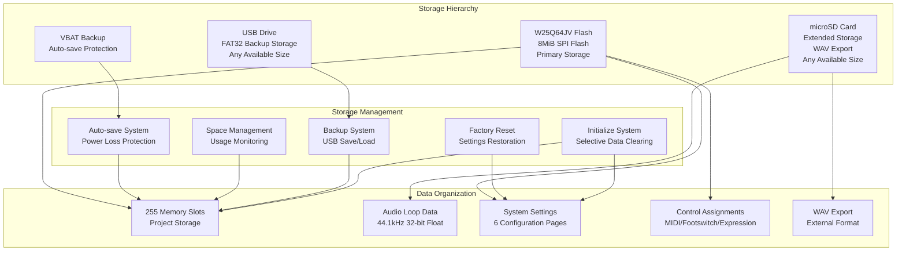
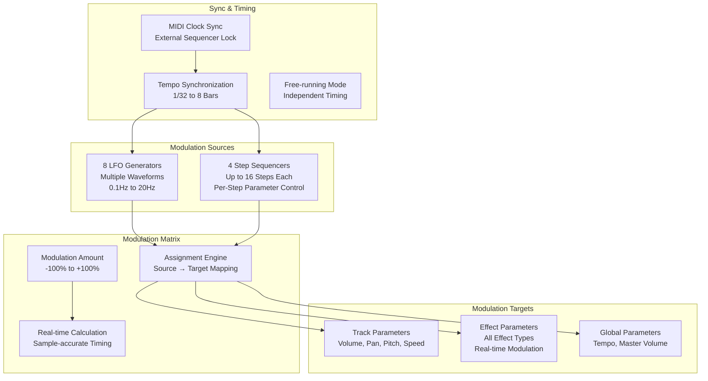

# Design Document

## Overview

The RC-505 MKII clone consists of two separate ecosystems:

### Hardware Ecosystem
1. **loopstation_core_stm32**: STM32H743VIT6 hardware core for real-time audio processing
2. **loopstation_display_network_esp32**: ESP32 module for display rendering and network communication

### PC Ecosystem  
1. **loopstation_core_stm32 (emulator/VM)**: Software emulation of the STM32 core logic
2. **loopstation_plugin_pc**: VST3/CLAP plugin wrapper for DAW integration

These are completely separate implementations that do not share code or architecture. The hardware ecosystem provides standalone loopstation functionality, while the PC ecosystem provides software-based development, testing, and DAW integration.

**Design Rationale**: The dual-ecosystem approach allows for independent development and optimization of each platform. The hardware ecosystem focuses on real-time performance and embedded constraints, while the PC ecosystem prioritizes cross-platform compatibility and DAW integration. This separation ensures that neither ecosystem is compromised by the constraints of the other.

## Architecture

### System Architecture Diagram

```mermaid
graph TB
    subgraph "Hardware Ecosystem"
        STM32_HW[loopstation_core_stm32<br/>STM32H743VIT6<br/>400MHz ARM Cortex-M7]
        ESP32_HW[loopstation_display_network_esp32<br/>ESP32<br/>Display & Network]
        AUDIO_IO[Audio I/O<br/>XLR/TRS Connectors<br/>24-bit ADC/32-bit DAC]
        CONTROLS[Hardware Controls<br/>Buttons/Faders/Knobs]
        STORAGE[Storage<br/>W25Q64JV Flash<br/>microSD Card]
        DISPLAY[128x64 LCD Display]
        
        STM32_HW <--> ESP32_HW
        STM32_HW <--> AUDIO_IO
        STM32_HW <--> CONTROLS
        STM32_HW <--> STORAGE
        ESP32_HW --> DISPLAY
    end
    
    subgraph "PC Ecosystem"
        EMU[loopstation_core_stm32<br/>(Emulator/VM)<br/>Cross-platform Software]
        PLUGIN[loopstation_plugin_pc<br/>VST3/CLAP Plugin<br/>DAW Integration]
        
        EMU <--> PLUGIN
    end
    
    subgraph "Network (Hardware Only)"
        OSC[OSC Protocol<br/>WiFi/Ethernet]
        ESP32_HW <--> OSC
    end
```

### Hardware Ecosystem Components

#### loopstation_core_stm32 (Hardware)
- Real-time audio processing (44.1kHz, 32-bit float, <5ms latency)
- 6-track loop recording, playback, and manipulation (up to 1.5 hours per track, ~13 hours total across all memories)
- Hardware control interface processing (10ms response time)
- MIDI I/O handling (CC and Note message support, Program Change for memory switching)
- Audio effects processing (Input FX, Track FX, Master FX with 4 slots each, 100+ effects total)
- FX Banks system (4 banks each for Input FX and Track FX presets)
- LFO and Step Sequencer modulation systems with parameter assignment
- Project management and storage (255 memory slots with complete project state)
- Auto-save functionality with VBAT backup power for power loss protection
- Comprehensive undo/redo system for track operations and effect parameter changes
- Communication with ESP32 via UART (115200 baud) with error recovery
- W25Q64JV Flash (8MiB) and microSD card storage management
- Dual USB system: USB Type-B for audio/MIDI interface, USB Type-A for project backup
- 16-channel USB audio interface (24-bit/96kHz) for DAW integration
- System settings with 6 configuration pages (GENERAL, CLOCK, MIDI, CONTROL, UTILITY, BACKUP)

#### loopstation_display_network_esp32
- 128x64 LCD backlit display rendering with real-time updates and clear visual feedback
- WiFi connectivity and OSC server (port 8000, <20ms response) with auto-reconnection
- Comprehensive menu system UI rendering with 8 main menus: CTL FUNC, Assign, Track, Input FX, Track FX, Master FX, Rhythm, LFO, Step Seq, Memory
- Multi-client OSC command processing and relay to STM32 without conflicts
- Real-time status monitoring with track recording/playback indicators and parameter displays
- Network status indication with WiFi and OSC connection status
- Bonjour/mDNS service advertisement for OSC discovery and multi-client support
- EDIT button functionality with real-time parameter editing and context-sensitive controls
- Menu navigation with PAGE buttons, VALUE knob, and hierarchical menu structure
- Communication with STM32 via UART (115200 baud) with command/response protocol and error recovery

### PC Ecosystem Components

#### loopstation_core_stm32 (Emulator/VM)
- Software emulation of loopstation functionality (separate implementation)
- Cross-platform audio processing using native libraries
- Virtual control interface simulation
- Development and testing platform
- Independent project management system
- No hardware dependencies

#### loopstation_plugin_pc
- VST3/CLAP plugin wrapper for DAW integration with identical functionality to hardware
- Host audio I/O interface with professional audio quality (32-bit float processing)
- Parameter automation support for all loopstation functions with DAW compatibility
- Project save/load integration with DAW serialization and hardware project compatibility
- MIDI input support for remote control (CC and Note messages, Program Change)
- Cross-platform compatibility (Windows/macOS/Linux) with consistent behavior
- Independent project management system optimized for software use
- Separate implementation from hardware ecosystem with no shared codebase
- Development and testing platform for loopstation functionality

## Hardware Component Specifications

### Audio Processing ICs

#### PCM1808 ADC (4x Units)
- **Function**: 24-bit stereo ADC for audio input processing
- **Configuration**: 4 units providing 8 channels total (MIC IN 1-4, INST IN 1-4)
- **Interface**: I2S digital audio interface to STM32H743VIT6
- **Sample Rate**: 44.1kHz/48kHz/96kHz support
- **SNR**: >100dB typical
- **Power Supply**: 3.3V digital, ±5V analog
- **Package**: SSOP-28

#### PCM5102A DAC (4x Units)  
- **Function**: 32-bit stereo DAC for audio output processing
- **Configuration**: 4 units providing 8 channels total (MAIN OUT, SUB OUT 1-4, PHONES)
- **Interface**: I2S digital audio interface from STM32H743VIT6
- **Sample Rate**: 44.1kHz/48kHz/96kHz/192kHz support
- **SNR**: >112dB typical
- **THD+N**: -93dB typical
- **Power Supply**: 3.3V digital, 3.3V analog
- **Package**: TSSOP-20

### Control Interface ICs

#### PCF8575 I2C I/O Expander (Multiple Units)
- **Function**: 16-bit I2C I/O expander for button matrix scanning
- **Configuration**: Multiple units to handle all buttons (TRACK1-6, FX1-5, TRANSPORT, MENU, etc.)
- **Interface**: I2C bus to STM32H743VIT6
- **I2C Address**: Configurable via A0-A2 pins (up to 8 devices per bus)
- **Input Features**: Interrupt-on-change capability for fast button response
- **Voltage**: 2.5V to 5.5V operation
- **Package**: TSSOP-24

#### KY-040 Rotary Encoder Module
- **Function**: Quadrature rotary encoder with push button for menu navigation
- **Configuration**: Single unit for VALUE knob functionality
- **Interface**: 3 digital pins to STM32H743VIT6 (CLK, DT, SW)
- **Resolution**: 20 pulses per revolution
- **Features**: Built-in pull-up resistors, push button switch
- **Voltage**: 5V operation
- **Mounting**: Standard 15mm rotary encoder shaft

#### 74HC595 Shift Register (Multiple Units)
- **Function**: 8-bit serial-to-parallel shift register for LED matrix control
- **Configuration**: Cascaded units to control all status LEDs
- **Interface**: SPI-compatible serial interface to STM32H743VIT6
- **LED Control**: Track status LEDs, FX status LEDs, menu indicators
- **Current**: 35mA per output (with current limiting resistors)
- **Voltage**: 2V to 6V operation
- **Package**: SOIC-16

### Hardware Integration Architecture

```mermaid
graph TB
    subgraph "STM32H743VIT6 Core"
        STM32[STM32H743VIT6<br/>400MHz ARM Cortex-M7<br/>1MB Flash, 1MB RAM]
        I2S_CTRL[I2S Controllers<br/>Audio Interface]
        I2C_CTRL[I2C Controllers<br/>Control Interface]
        SPI_CTRL[SPI Controllers<br/>LED Control]
        ADC_CTRL[ADC Controllers<br/>Analog Inputs]
    end
    
    subgraph "Audio Processing"
        PCM1808_1[PCM1808 #1<br/>MIC IN 1,2]
        PCM1808_2[PCM1808 #2<br/>MIC IN 3,4]
        PCM1808_3[PCM1808 #3<br/>INST IN 1,2]
        PCM1808_4[PCM1808 #4<br/>INST IN 3,4]
        
        PCM5102A_1[PCM5102A #1<br/>MAIN OUT L,R]
        PCM5102A_2[PCM5102A #2<br/>SUB OUT 1,2]
        PCM5102A_3[PCM5102A #3<br/>SUB OUT 3,4]
        PCM5102A_4[PCM5102A #4<br/>PHONES L,R]
    end
    
    subgraph "Control Matrix"
        PCF8575_1[PCF8575 #1<br/>TRACK Buttons 1-6]
        PCF8575_2[PCF8575 #2<br/>FX Buttons 1-5<br/>TRANSPORT Controls]
        PCF8575_3[PCF8575 #3<br/>MENU Navigation<br/>MEMORY/UNDO]
        KY040[KY-040<br/>Rotary Encoder<br/>VALUE Knob]
    end
    
    subgraph "LED Matrix"
        HC595_1[74HC595 #1<br/>TRACK LEDs 1-6]
        HC595_2[74HC595 #2<br/>FX LEDs 1-5<br/>STATUS LEDs]
        HC595_3[74HC595 #3<br/>MENU LEDs<br/>TRANSPORT LEDs]
    end
    
    subgraph "Analog Controls"
        FADERS[Track Faders 1-6<br/>Output Level Fader]
        KNOBS[Knobs 1-4<br/>Context Sensitive]
        EXP_PEDALS[Expression Pedals<br/>CTL1-4/EXP1-2]
    end
    
    I2S_CTRL --> PCM1808_1
    I2S_CTRL --> PCM1808_2
    I2S_CTRL --> PCM1808_3
    I2S_CTRL --> PCM1808_4
    I2S_CTRL --> PCM5102A_1
    I2S_CTRL --> PCM5102A_2
    I2S_CTRL --> PCM5102A_3
    I2S_CTRL --> PCM5102A_4
    
    I2C_CTRL --> PCF8575_1
    I2C_CTRL --> PCF8575_2
    I2C_CTRL --> PCF8575_3
    
    SPI_CTRL --> HC595_1
    SPI_CTRL --> HC595_2
    SPI_CTRL --> HC595_3
    
    STM32 --> KY040
    ADC_CTRL --> FADERS
    ADC_CTRL --> KNOBS
    ADC_CTRL --> EXP_PEDALS
```



## Components and Interfaces

### Audio Processing Pipeline with FX Layers

```mermaid
graph LR
    subgraph "Input Stage"
        MIC_IN[MIC IN (1,2) & (3,4)<br/>XLR Balanced + Phantom Power<br/>PCM1808 ADC Processing]
        INST_IN[INST IN (1,2) & (3,4)<br/>1/4" Phone Jacks<br/>PCM1808 ADC Processing]
        USB_IN[USB Audio Interface<br/>Computer Input<br/>16-Channel DAW Routing]
        MIDI_IN[MIDI IN<br/>5-pin DIN Standard]
    end
    
    subgraph "FX Layer 1: Input FX"
        ADC[4x PCM1808 ADC<br/>24-bit, 44.1kHz Sampling<br/>I2S Interface]
        INPUT_FX[Input FX Chain<br/>4 Slots: Noise Suppressor<br/>Guitar Amp Sims, Vocal Pitch<br/>Compressor - PRE-RECORDING]
    end
    
    subgraph "Recording & Playback"
        ROUTER[Audio Router<br/>Track Selection]
        TRACKS[6 Track Loopers<br/>32-bit Float Processing<br/>1.5hrs per track]
    end
    
    subgraph "FX Layer 2: Track FX"
        TRACK_FX[Track FX Chain<br/>4 Slots per Track: Loop Slicer<br/>Reverb, Delay, Isolator<br/>Beat Repeat - POST-RECORDING]
    end
    
    subgraph "Mixing & Final Processing"
        MIXER[6-Channel Mixer<br/>Level Faders + Mute]
        MASTER_FX[Master FX Chain<br/>4 Slots: Mastering EQ<br/>Multiband Compressor<br/>Limiter, DJ Filter - FINAL OUTPUT]
        DAC[4x PCM5102A DAC<br/>32-bit, I2S Interface<br/>Professional Quality]
    end
    
    subgraph "Output Stage"
        MAIN_OUT[MAIN OUT<br/>1/4" Phone Jacks<br/>Primary Output - PCM5102A]
        SUB_OUT[SUB OUT (1,2) & (3,4)<br/>1/4" Phone Jacks<br/>Auxiliary Outputs - PCM5102A]
        PHONES[PHONES<br/>1/4" Stereo Jack<br/>Headphone Monitoring - PCM5102A]
        USB_OUT[USB Audio Interface<br/>Computer Output<br/>16-Channel DAW Integration]
        MIDI_OUT[MIDI OUT<br/>5-pin DIN Standard]
        DC_IN[DC IN<br/>Dedicated Power Jack]
    end
    
    subgraph "FX Control"
        FX_BUTTONS[FX 1-5 Buttons<br/>Short: Momentary<br/>Long: Toggle]
        KNOBS_FX[Knobs 1-4<br/>Real-time FX Parameters]
        MIDI_SYNC[MIDI Clock Sync<br/>Tempo-locked Effects]
    end
    
    MIC_IN --> ADC
    INST_IN --> ADC
    USB_IN --> INPUT_FX
    ADC --> INPUT_FX
    INPUT_FX --> ROUTER
    ROUTER --> TRACKS
    TRACKS --> TRACK_FX
    TRACK_FX --> MIXER
    MIXER --> MASTER_FX
    MASTER_FX --> DAC
    DAC --> MAIN_OUT
    DAC --> SUB_OUT
    DAC --> PHONES
    MASTER_FX --> USB_OUT
    MIDI_IN --> ROUTER
    MIXER --> MIDI_OUT
    
    FX_BUTTONS --> INPUT_FX
    FX_BUTTONS --> TRACK_FX
    FX_BUTTONS --> MASTER_FX
    KNOBS_FX --> INPUT_FX
    KNOBS_FX --> TRACK_FX
    KNOBS_FX --> MASTER_FX
    MIDI_SYNC --> TRACK_FX
    MIDI_SYNC --> MASTER_FX
```

### Control System Architecture



### Communication Interfaces

#### STM32 ↔ ESP32 Communication
- **Protocol**: UART (115200 baud)
- **Message Format**: ByteHeader/BufferData-based command/response
- **Commands**: Display updates, menu navigation, parameter changes
- **Responses**: Button presses, network commands, status updates
- **Reliability**: Error detection and automatic retry for critical commands
- **Graceful Degradation**: STM32 continues operation if ESP32 communication fails

**Design Rationale**: UART provides reliable, low-latency communication between the processors. The 115200 baud rate offers sufficient bandwidth for real-time display updates while maintaining robust communication. The command/response protocol ensures message integrity and allows for error recovery.

#### ESP32 ↔ Network Communication
- **Protocol**: OSC over UDP/TCP
- **Port**: 8000 (configurable)
- **Message Types**: Parameter control, status broadcast, project management
- **Discovery**: Bonjour/mDNS service advertisement for OSC discovery
- **Response Time**: <20ms for OSC command execution
- **Multi-client**: Support for concurrent OSC client connections
- **Auto-reconnect**: Automatic WiFi reconnection on connection loss
- **Status Broadcasting**: Real-time loopstation state changes broadcast to connected clients
- **Command Processing**: Multi-client OSC command processing without conflicts

#### PC Plugin ↔ Host DAW
- **Audio**: VST3/CLAP audio buffers (32-bit float)
- **Parameters**: Automation-compatible parameter mapping
- **MIDI**: Standard MIDI input for control (CC and Note messages)
- **State**: Project save/load via host serialization
- **Compatibility**: Identical functionality to hardware version
- **Sync**: Hardware project compatibility for seamless workflow

### FX System Architecture

```mermaid
graph TB
    subgraph "FX Layer Organization"
        INPUT_LAYER[Input FX Layer<br/>4 Slots<br/>Pre-Recording Processing]
        TRACK_LAYER[Track FX Layer<br/>4 Slots × 6 Tracks<br/>Post-Recording Processing]
        MASTER_LAYER[Master FX Layer<br/>4 Slots<br/>Final Output Processing]
    end
    
    subgraph "Effect Categories"
        LOOP_MGMT[Loop Management<br/>SLICER, BEAT REPEAT, REVERSE]
        TIME_BASED[Time-Based<br/>TAPE ECHO, SPACE REVERB, T3 DELAY]
        DYNAMICS[Dynamics<br/>COMPRESSOR, NOISE SUPPRESSOR, LIMITER]
        FILTERS[Filters<br/>AUTO WAH, ISOLATOR, DJ FILTER]
        PITCH_MOD[Pitch/Modulation<br/>PITCH SHIFT, CHORUS, FLANGER]
        AMP_SIM[Amp Simulation (COSM)<br/>JC-120, TWEED, METAL]
        UTILITY[Utility<br/>MIXER, SIDECHAIN]
    end
    
    subgraph "FX Control Interface"
        FX_BUTTONS[FX 1-5 Buttons<br/>Short: Momentary<br/>Long: Toggle]
        KNOB_CONTROL[Knobs 1-4<br/>Real-time Parameter Control]
        MIDI_SYNC_CTRL[MIDI Clock Sync<br/>Tempo-locked Effects]
        CTL_FUNC_ASSIGN[CTL FUNC Menu<br/>Effect Assignment to Buttons]
    end
    
    subgraph "FX Banks System"
        INPUT_FX_BANKS[Input FX Banks 1-4<br/>Complete Effect Chain Presets]
        TRACK_FX_BANKS[Track FX Banks 1-4<br/>Per-Track Effect Presets<br/>Independent Selection]
        FX_BANK_SAVE[FX Bank Save<br/>Store Complete Chain Configuration]
        FX_BANK_LOAD[FX Bank Load<br/>Instant Preset Application]
        FX_BANK_EDIT[FX Bank Real-time Edit<br/>Parameter Modification]
    end
    
    subgraph "Advanced FX Features"
        PARALLEL_CHAINS[Parallel Effect Chains<br/>Wet/Dry Blends via MIXER]
        MIDI_TEMPO[MIDI-Synced Effects<br/>Clock-locked Timing]
        VOCAL_CHAIN[Preset Effect Chains<br/>Optimized Combinations]
        UNDO_FX[FX Undo System<br/>Parameter Change Reversal]
    end
    
    INPUT_LAYER --> LOOP_MGMT
    INPUT_LAYER --> DYNAMICS
    INPUT_LAYER --> AMP_SIM
    
    TRACK_LAYER --> LOOP_MGMT
    TRACK_LAYER --> TIME_BASED
    TRACK_LAYER --> FILTERS
    
    MASTER_LAYER --> DYNAMICS
    MASTER_LAYER --> FILTERS
    MASTER_LAYER --> UTILITY
    
    FX_BUTTONS --> INPUT_LAYER
    FX_BUTTONS --> TRACK_LAYER
    FX_BUTTONS --> MASTER_LAYER
    
    KNOB_CONTROL --> INPUT_LAYER
    KNOB_CONTROL --> TRACK_LAYER
    KNOB_CONTROL --> MASTER_LAYER
    
    MIDI_SYNC_CTRL --> TIME_BASED
    CTL_FUNC_ASSIGN --> FX_BUTTONS
    
    INPUT_FX_BANKS --> INPUT_LAYER
    TRACK_FX_BANKS --> TRACK_LAYER
    FX_BANK_LOAD --> INPUT_LAYER
    FX_BANK_LOAD --> TRACK_LAYER
```

### Menu System and EDIT Button Architecture

```mermaid
graph TB
    subgraph "Menu Navigation"
        MAIN_MENU[Main Menu<br/>Entry Point]
        CTL_FUNC[CTL FUNC Menu<br/>Button/Pedal Assignment]
        ASSIGN[Assign Menu<br/>MIDI/CC Mapping]
        TRACK_MENU[Track Menu<br/>Per-Track Settings]
        INPUT_FX_MENU[Input FX Menu<br/>Pre-Recording Effects]
        TRACK_FX_MENU[Track FX Menu<br/>Track-Specific Effects]
        MASTER_FX_MENU[Master FX Menu<br/>Output Effects]
        RHYTHM_MENU[Rhythm Menu<br/>Drum Patterns]
        LFO_MENU[LFO Menu<br/>LFO Configuration & Assignment]
        STEP_SEQ_MENU[Step Sequencer Menu<br/>Step Sequencer Programming]
        MEMORY_MENU[Memory Menu<br/>Project Management]
    end
    
    subgraph "EDIT Button System"
        EDIT_BTN[EDIT Button<br/>Real-time Parameter Control]
        FX_EDIT[FX Parameter Editing<br/>Live Knob Control]
        TRACK_EDIT[Track Parameter Editing<br/>Volume/Pan/Mode/Quantize]
        ADVANCED_EDIT[Advanced Parameters<br/>Start/End Point, Reverse, Pitch]
        DIRECT_EDIT[Direct Parameter Override<br/>Hold EDIT + Knob]
    end
    
    subgraph "Memory System Interface"
        MEMORY_BTN[MEMORY Button<br/>Memory Slot Access]
        VALUE_KNOB[VALUE Knob<br/>Memory Navigation 1-255]
        PAGE_MEMORY[PAGE Buttons<br/>Memory Navigation +/-10]
        MEMORY_SAVE[HOLD MEMORY + ENTER<br/>Instant Save]
        MEMORY_LOAD[ENTER<br/>0.5s Load Time]
        FOOTSWITCH_NAV[Footswitch Assignment<br/>Memory Inc/Dec for hands-free navigation]
    end
    
    subgraph "Navigation Controls"
        MENU_BTN[MENU Button<br/>Open/Top Level]
        PAGE_BTNS[PAGE Buttons<br/>Left/Right Navigation<br/>Advanced Parameters in EDIT]
        KNOBS_NAV[Knobs 1-4<br/>Context-Sensitive Control]
        ENTER_BTN[ENTER Button<br/>Confirm/Edit]
        EXIT_BTN[EXIT Button<br/>Back/Cancel]
    end
    
    MENU_BTN --> MAIN_MENU
    MAIN_MENU --> CTL_FUNC
    MAIN_MENU --> ASSIGN
    MAIN_MENU --> TRACK_MENU
    MAIN_MENU --> INPUT_FX_MENU
    MAIN_MENU --> TRACK_FX_MENU
    MAIN_MENU --> MASTER_FX_MENU
    MAIN_MENU --> RHYTHM_MENU
    MAIN_MENU --> LFO_MENU
    MAIN_MENU --> STEP_SEQ_MENU
    MAIN_MENU --> MEMORY_MENU
    
    EDIT_BTN --> FX_EDIT
    EDIT_BTN --> TRACK_EDIT
    EDIT_BTN --> ADVANCED_EDIT
    EDIT_BTN --> DIRECT_EDIT
    
    MEMORY_BTN --> MEMORY_MENU
    VALUE_KNOB --> BANK_SAVE
    VALUE_KNOB --> BANK_LOAD
    PAGE_BANKS --> MEMORY_MENU
    
    PAGE_BTNS --> MAIN_MENU
    PAGE_BTNS --> ADVANCED_EDIT
    KNOBS_NAV --> FX_EDIT
    KNOBS_NAV --> TRACK_EDIT
    ENTER_BTN --> BANK_LOAD
    EXIT_BTN --> MAIN_MENU
```



### System Settings Architecture



### USB Connectivity Architecture

```mermaid
graph TB
    subgraph "Dual USB System"
        USB_COMPUTER[USB Type-B<br/>USB COMPUTER Port<br/>Audio/MIDI Interface]
        USB_MEMORY[USB Type-A<br/>USB MEMORY Port<br/>Project Backup & Sample Management]
    end
    
    subgraph "USB Computer Functions"
        AUDIO_IF[16-Channel Audio Interface<br/>24-bit/96kHz Quality]
        MIDI_IF[USB MIDI Interface<br/>CC/PC/Clock Sync]
        DAW_ROUTING[DAW Track Routing<br/>Individual Track I/O]
        ZERO_LATENCY[Zero-Latency Monitoring<br/>Direct Monitoring]
    end
    
    subgraph "USB Memory Functions"
        PROJECT_BACKUP[Project Backup<br/>Save/Load All Memory Slots]
        WAV_EXPORT[WAV Export<br/>Individual Track Audio]
        SAMPLE_IMPORT[Sample Import<br/>WAV Files (44.1/48kHz, 16-24bit)]
        FIRMWARE_UPDATE[Firmware Updates<br/>System Maintenance]
        MANAGER_SYNC[RC-505mk2 Manager<br/>Project Organization]
    end
    
    USB_COMPUTER --> AUDIO_IF
    USB_COMPUTER --> MIDI_IF
    USB_COMPUTER --> DAW_ROUTING
    USB_COMPUTER --> ZERO_LATENCY
    
    USB_MEMORY --> PROJECT_BACKUP
    USB_MEMORY --> WAV_EXPORT
    USB_MEMORY --> SAMPLE_IMPORT
    USB_MEMORY --> FIRMWARE_UPDATE
    USB_MEMORY --> MANAGER_SYNC
```

### Storage System Architecture



## Error Handling

### Hardware Error Recovery
- **Audio Dropout Protection**: Automatic buffer management and recovery from audio underruns/overruns
- **Communication Failure**: STM32-ESP32 communication timeout handling with graceful degradation
- **Storage Errors**: Flash memory error detection with automatic retry and backup mechanisms
- **Power Loss Protection**: VBAT backup system ensures project data integrity during unexpected power loss

### Network Error Handling
- **WiFi Disconnection**: Automatic reconnection attempts with exponential backoff
- **OSC Command Failures**: Invalid command rejection with error response to clients
- **Multi-client Conflicts**: Command queuing and priority handling for concurrent OSC clients

### User Error Prevention
- **Parameter Validation**: Real-time validation of all user inputs with immediate feedback
- **Undo System**: Comprehensive undo/redo for accidental operations (configurable scope)
- **Confirmation Dialogs**: Critical operations (clear all, factory reset) require confirmation
- **Auto-save Protection**: Continuous background saving prevents data loss

## Testing Strategy

### Unit Testing Approach
- **Audio Processing**: Automated tests for sample-accurate timing, latency measurements, and audio quality validation
- **Effect Processing**: Individual effect algorithm testing with known input/output pairs
- **State Management**: Track state transition testing and memory system validation
- **Communication Protocols**: UART, OSC, and MIDI message handling verification

### Integration Testing
- **Hardware Integration**: STM32-ESP32 communication reliability testing under load
- **Network Integration**: Multi-client OSC testing with concurrent command processing
- **Audio Chain Testing**: End-to-end audio processing validation through all FX layers
- **Memory System Testing**: Project save/load integrity across all storage mediums

### Performance Testing
- **Latency Validation**: Automated measurement of audio processing latency (<5ms requirement)
- **Real-time Performance**: CPU usage monitoring under maximum load (6 tracks + effects)
- **Memory Usage**: RAM and storage utilization tracking and optimization
- **Network Performance**: OSC response time validation (<20ms requirement)

### Hardware-in-the-Loop Testing
- **Control Interface**: Automated button press simulation and response time measurement
- **Audio I/O**: Loopback testing of all audio inputs and outputs
- **MIDI Integration**: External MIDI device integration testing
- **Storage Validation**: Flash memory and SD card reliability testing

## Data Models

### Track Data Structure
```rust
struct Track {
    id: u8,                    // Track number (1-6)
    audio_buffer: CircularBuffer<f32>, // Stereo audio data (up to 1.5 hours per track, ~13 hours total across all memories)
    state: TrackState,         // Recording/Playing/Stopped/Muted
    level: f32,                // Track volume (0.0-1.0)
    effects: EffectChain,      // Track-specific effects
    loop_length: u32,          // Length in samples
    play_position: u32,        // Current playback position
    record_position: u32,      // Current record position
    quantize_enabled: bool,    // Quantization on/off
    input_source: InputSource, // MIC/INST routing
    playback_mode: PlaybackMode, // Normal/Reverse/Speed variations
    fade_in_out: FadeSettings, // Smooth transitions
    undo_buffer: Vec<AudioSnapshot>, // Action history for undo/redo
    selected: bool,            // Track selection state
}

enum TrackState {
    Stopped,
    Recording,
    Playing,
    Overdubbing,
    Muted,
}

enum PlaybackMode {
    Normal,
    Reverse,
    HalfSpeed,
    DoubleSpeed,
    PitchShift(f32),
}

struct FadeSettings {
    fade_in_time: f32,
    fade_out_time: f32,
    enabled: bool,
}
```

### Effect Chain Structure
```rust
struct EffectChain {
    slots: [Option<Effect>; 4], // 4 effects per chain (Input/Track/Master)
    mix_level: f32,             // Wet/dry mix
    enabled: bool,              // Chain bypass
    chain_type: EffectChainType, // Input/Track/Master
    fx_bank: u8,                // FX Bank (1-4) for effect presets
}

struct Effect {
    effect_type: EffectType,
    parameters: EffectParams,
    enabled: bool,
    momentary: bool,            // For FX button momentary effects
    midi_sync: bool,            // MIDI clock synchronization
    dry_wet_mix: f32,           // Individual effect wet/dry balance
}

enum EffectChainType {
    InputFX,    // Pre-recording (affects recorded audio)
    TrackFX,    // Per-track processing (post-recording)
    MasterFX,   // Final output (affects all tracks)
}

enum EffectType {
    // Loop Management
    Slicer,
    BeatRepeat,
    Reverse,
    
    // Time-Based Effects
    TapeEcho,
    SpaceReverb,
    T3Delay,
    
    // Dynamics
    Compressor,
    NoiseSuppressor,
    Limiter,
    MultibandCompressor,
    
    // Filters
    AutoWah,
    Isolator,
    DJFilter,
    MasteringEQ,
    
    // Pitch/Modulation
    PitchShift,
    Chorus,
    Flanger,
    PitchCorrect,
    
    // Amp Simulation (COSM)
    JC120,
    Tweed,
    Metal,
    
    // Utility
    Mixer,
    Sidechain,
    
    // 100+ total effects matching RC-505 MKII
}
```

### FX Banks System (Effect Presets)
```rust
struct FXBankSystem {
    input_fx_banks: [EffectChain; 4],  // FX Banks 1-4 for Input FX presets
    track_fx_banks: [EffectChain; 4],  // FX Banks 1-4 for Track FX presets per track
    current_input_fx_bank: u8,         // Currently selected Input FX bank (1-4)
    current_track_fx_bank: [u8; 6],    // Currently selected Track FX bank per track (1-4)
    bank_names: HashMap<(EffectChainType, u8), String>, // Bank names for display
}

// Design Rationale: Each of the 6 tracks has independent FX Bank selection
// allowing different tracks to use different effect presets simultaneously.
// This provides maximum flexibility for complex multi-track arrangements.
```

### Memory System (Project Storage)
```rust
struct MemorySystem {
    memory_slots: [Option<Project>; 255], // 255 numbered memory slots (1-255)
    current_memory: u8,                   // Currently selected memory slot (1-255)
    tempo_memory_enabled: bool,           // Prevent tempo changes on load
    store_mode: StoreMode,                // Full or Settings-only save
}

enum StoreMode {
    Full,        // Save loops + settings
    SettingOnly, // Save only FX/tempo/assignments
}

struct Project {
    memory_slot: u8,               // Memory slot number (1-255)
    name: String,                  // Project name (via RC-505mk2 Manager)
    tracks: [Track; 6],            // All 6 tracks with individual Track FX chains
    tempo: f32,                    // BPM
    rhythm_pattern: RhythmPattern,
    input_fx: EffectChain,         // Input FX chain (4 slots, pre-recording)
    master_fx: EffectChain,        // Master FX chain (4 slots, final output)
    modulation: ModulationSystem,  // LFOs and Step Sequencers
    assignments: ControlAssignments, // FX button assignments and MIDI mappings
    created: Timestamp,
    modified: Timestamp,
    auto_save_enabled: bool,       // VBAT backup auto-save
    total_recording_time: f32,     // Track total time usage
    midi_program_change: u8,       // MIDI PC number for external control (Memory 1=PC#0, Memory 2=PC#1, etc.)
}

struct RhythmPattern {
    pattern_name: String,
    beats_per_measure: u8,
    pattern_data: Vec<u8>,
    enabled: bool,
}
```

### Control Assignment Structure
```rust
struct ControlAssignments {
    button_assignments: HashMap<ButtonId, ButtonFunction>,
    midi_assignments: HashMap<MidiCC, Parameter>,
    expression_assignments: HashMap<ExpressionInput, Parameter>,
    knob_assignments: HashMap<KnobId, Parameter>, // Context-sensitive knob mapping
}

enum ButtonFunction {
    TrackPlayStop(u8),
    TrackRecord(u8),
    TrackClear(u8),
    TrackSelect(u8),
    TrackMute(u8),
    EffectMomentary(EffectSlot),
    EffectToggle(EffectSlot),
    AllStart,
    AllStop,
    AllClear,
    Undo,
    Redo,
    TapTempo,
    TempoReset,
    MenuOpen,
    MenuExit,
    PageLeft,
    PageRight,
    Enter,
    MemorySave,
    MemoryLoad,
    // ... additional functions
}

enum ExpressionInput {
    CTL1_EXP1,
    CTL2_EXP1,
    CTL3_EXP2,
    CTL4_EXP2,
}

enum KnobId {
    Knob1,
    Knob2,
    Knob3,
    Knob4,
}

### LFO and Step Sequencer Architecture



**Design Rationale**: The modulation system provides extensive automation capabilities without requiring external controllers. The matrix-based assignment system allows any modulation source to control any parameter, enabling complex soundscapes and dynamic performances. Sample-accurate timing ensures precise modulation without audio artifacts.

### LFO and Step Sequencer System Structure
```rust
struct ModulationSystem {
    lfos: [LFO; 8],                    // 8 LFO generators
    step_sequencers: [StepSequencer; 4], // 4 step sequencers
    modulation_matrix: ModulationMatrix, // Assignment matrix
}

struct LFO {
    id: u8,                           // LFO number (1-8)
    waveform: LFOWaveform,            // Sine, Triangle, Square, Sawtooth, Random
    rate: f32,                        // 0.1Hz to 20Hz
    depth: f32,                       // 0-100%
    phase_offset: f32,                // 0-360 degrees
    sync_mode: SyncMode,              // Free/Tempo Sync
    tempo_division: TempoDivision,    // 1/32 to 8 bars
    enabled: bool,
    current_value: f32,               // Current LFO output (-1.0 to 1.0)
}

enum LFOWaveform {
    Sine,
    Triangle,
    Square,
    Sawtooth,
    Random,
}

struct StepSequencer {
    id: u8,                           // Step sequencer number (1-4)
    steps: [Step; 16],                // Up to 16 steps
    length: u8,                       // Active step count (1-16)
    current_step: u8,                 // Current playback position
    tempo_division: TempoDivision,    // Step timing
    swing: f32,                       // Swing amount (0-100%)
    enabled: bool,
}

struct Step {
    active: bool,                     // Step on/off
    velocity: f32,                    // Step velocity (0-1.0)
    gate_length: f32,                 // Gate length (0-100%)
    parameter_values: HashMap<Parameter, f32>, // Per-step parameter control
}

struct ModulationMatrix {
    assignments: Vec<ModulationAssignment>,
}

struct ModulationAssignment {
    source: ModulationSource,         // LFO or Step Sequencer
    target: Parameter,                // Target parameter
    amount: f32,                      // Modulation amount (-100% to +100%)
    enabled: bool,
}

enum ModulationSource {
    LFO(u8),                         // LFO 1-8
    StepSequencer(u8),               // Step Sequencer 1-4
}

enum SyncMode {
    Free,                            // Free-running
    TempoSync,                       // Synced to tempo
}

enum TempoDivision {
    ThirtySecond,                    // 1/32
    Sixteenth,                       // 1/16
    Eighth,                          // 1/8
    Quarter,                         // 1/4
    Half,                            // 1/2
    Whole,                           // 1/1
    TwoBars,                         // 2 bars
    FourBars,                        // 4 bars
    EightBars,                       // 8 bars
}
```

### EDIT Button System Structure
```rust
struct EditSystem {
    active: bool,
    edit_mode: EditMode,
    target_effect: Option<EffectSlot>,
    target_track: Option<u8>,
    target_lfo: Option<u8>,           // For LFO editing
    target_step_seq: Option<u8>,      // For Step Sequencer editing
    parameter_page: u8,               // For PAGE button navigation
    temporary_changes: HashMap<Parameter, f32>, // Unsaved edits
}

enum EditMode {
    FXEdit {
        effect_slot: EffectSlot,
        parameters: [Parameter; 4], // Primary parameters on knobs 1-4
        advanced_parameters: [Parameter; 4], // Secondary via PAGE
    },
    TrackEdit {
        track_id: u8,
        parameters: TrackEditParams,
    },
    LFOEdit {
        lfo_id: u8,
        parameters: LFOEditParams,
    },
    StepSequencerEdit {
        step_seq_id: u8,
        parameters: StepSeqEditParams,
    },
    DirectEdit {
        parameter: Parameter,
        original_value: f32,
    },
}

struct LFOEditParams {
    waveform: LFOWaveform,            // Knob 1
    rate: f32,                        // Knob 2
    depth: f32,                       // Knob 3
    phase_offset: f32,                // Knob 4
    // Advanced parameters (PAGE button)
    sync_mode: SyncMode,              // Knob 1 + PAGE
    tempo_division: TempoDivision,    // Knob 2 + PAGE
}

struct StepSeqEditParams {
    length: u8,                       // Knob 1 (1-16 steps)
    tempo_division: TempoDivision,    // Knob 2
    swing: f32,                       // Knob 3
    current_step_velocity: f32,       // Knob 4
    // Advanced parameters (PAGE button)
    gate_length: f32,                 // Knob 1 + PAGE
    step_parameter_value: f32,        // Knob 2 + PAGE (for selected parameter)
}

struct TrackEditParams {
    volume: f32,           // Knob 1
    pan: f32,              // Knob 2
    play_mode: PlaybackMode, // Knob 3
    quantize: bool,        // Knob 4
    // Advanced parameters (PAGE button)
    start_point: f32,      // Knob 1 + PAGE
    end_point: f32,        // Knob 2 + PAGE
    reverse: bool,         // Knob 3 + PAGE
    pitch: f32,            // Knob 4 + PAGE (-24 to +24 semitones)
}

struct EffectSlot {
    chain_type: EffectChainType,
    slot_index: u8,        // 1-4
    track_id: Option<u8>,  // For Track FX only
}

### System Settings Structure
```rust
struct SystemSettings {
    general: GeneralSettings,
    clock: ClockSettings,
    midi: MidiSettings,
    control: ControlSettings,
    utility: UtilitySettings,
    backup: BackupSettings,
}

struct GeneralSettings {
    tempo_memory: bool,           // Keep tempo when loading banks
    quantize_mode: QuantizeMode,  // FULL/REC/OFF
    undo_mode: UndoMode,          // REC/REC+PLAY/ALL
    startup_screen: StartupScreen, // OFF/MEMORY/NAME
    auto_off: AutoOffTime,        // 5min/30min/OFF
    phones_mode: PhonesMode,      // STEREO/MONO
    store_mode: StoreMode,        // LOOP+SETTING/SETTING
}

struct ClockSettings {
    clock_source: ClockSource,    // INTERNAL/USB/MIDI
    sync_out: SyncOut,            // OFF/USB/MIDI
    rec_quantize: RecQuantize,    // 1/1 to 1/32
}

struct MidiSettings {
    midi_channel: MidiChannel,    // 1-16/OMNI
    local_control: bool,          // ON/OFF (disable for DAW use)
    pc_out: bool,                 // Send Program Change on bank load
    cc_tx_rx: bool,               // Enable Control Change messages
}

struct ControlSettings {
    ctl_func_assign: CtlFuncAssign, // PANEL/UNDO/OFF
    foot_sw_assign: FootSwAssign,    // REC/PLAY/MEMORY/etc.
    exp_pedal_mode: ExpPedalMode,    // CONTINUOUS/TOGGLE
}

struct UtilitySettings {
    firmware_version: String,
    // Functions: factory_reset(), initialize(), format_memory()
}

struct BackupSettings {
    // Functions: save_to_usb(), load_from_usb(), export_import_manager()
}

enum QuantizeMode {
    Full,
    Rec,
    Off,
}

enum UndoMode {
    Rec,
    RecPlay,
    All,
}

enum StartupScreen {
    Off,
    Memory,
    Name,
}

enum AutoOffTime {
    FiveMinutes,
    ThirtyMinutes,
    Off,
}

enum PhonesMode {
    Stereo,
    Mono,
}

enum ClockSource {
    Internal,
    USB,
    MIDI,
}

enum SyncOut {
    Off,
    USB,
    MIDI,
}

enum RecQuantize {
    Whole,      // 1/1
    Half,       // 1/2
    Quarter,    // 1/4
    Eighth,     // 1/8
    Sixteenth,  // 1/16
    ThirtySecond, // 1/32
}

enum MidiChannel {
    Channel(u8), // 1-16
    Omni,
}

enum CtlFuncAssign {
    Panel,
    Undo,
    Off,
}

enum FootSwAssign {
    RecPlay,
    MemoryInc,
    MemoryDec,
    UndoRedo,
    TapTempo,
    AllStart,
    AllStop,
    // ... additional assignments
}

enum ExpPedalMode {
    Continuous, // Wah-style
    Toggle,     // On/off behavior
}

### USB System Structure
```rust
struct USBSystem {
    computer_interface: USBComputerInterface,
    memory_interface: USBMemoryInterface,
}

struct USBComputerInterface {
    audio_interface: AudioInterface,
    midi_interface: MidiInterface,
    driver_mode: USBDriverMode,
    zero_latency_monitoring: bool,
}

struct AudioInterface {
    sample_rate: SampleRate,        // 44.1kHz, 48kHz, 96kHz
    bit_depth: BitDepth,            // 16, 24-bit
    input_channels: u8,             // 16 channels (Mic/Line + Tracks)
    output_channels: u8,            // Master L/R + Phones
    buffer_size: u32,               // Configurable for latency
}

struct MidiInterface {
    cc_enabled: bool,               // Control Change messages
    program_change_enabled: bool,   // Bank switching via PC
    clock_sync_enabled: bool,       // Send/receive MIDI clock
    local_control: bool,            // Internal trigger disable for DAW
}

struct USBMemoryInterface {
    connected_drive: Option<USBDrive>,
    supported_formats: Vec<FileFormat>,
    max_files: u8,                  // 99 files max
}

struct USBDrive {
    capacity: u32,                  // Max 32GB
    format: DriveFormat,            // Must be FAT32
    available_space: u32,
    files: Vec<USBFile>,
}

struct USBFile {
    filename: String,
    file_type: FileType,
    size: u32,
    format: AudioFormat,
}

enum USBDriverMode {
    Vendor,    // Low latency Roland driver
    Generic,   // Standard USB audio driver
}

enum SampleRate {
    Rate44100,
    Rate48000,
    Rate96000,
}

enum BitDepth {
    Bit16,
    Bit24,
    Bit32,
}

enum DriveFormat {
    FAT32,
    // exFAT and NTFS not supported
}

enum FileType {
    ProjectBackup,
    AudioWAV,
    FirmwareUpdate,
}

enum AudioFormat {
    WAV44116,   // 44.1kHz, 16-bit
    WAV44124,   // 44.1kHz, 24-bit
    WAV44132,   // 44.1kHz, 32-bit
    WAV48016,   // 48kHz, 16-bit
    WAV48024,   // 48kHz, 24-bit
    WAV48032,   // 48kHz, 32-bit
}

// USB Operations
impl USBSystem {
    fn backup_projects(&mut self) -> Result<(), USBError> {
        // Save all banks and settings to USB drive
    }
    
    fn restore_projects(&mut self) -> Result<(), USBError> {
        // Load projects from USB drive
    }
    
    fn import_wav(&mut self, file: USBFile, target_track: u8) -> Result<(), USBError> {
        // Import WAV file to specified track
    }
    
    fn export_track(&mut self, track_id: u8) -> Result<(), USBError> {
        // Export track audio as WAV file
    }
    
    fn update_firmware(&mut self, firmware_file: USBFile) -> Result<(), USBError> {
        // Install firmware update from USB
    }
}
```

### Audio I/O and USB Connectivity Specifications

```mermaid
graph TB
    subgraph "Input Connections"
        MIC_XLR[MIC IN 1,2 & 3,4<br/>XLR Balanced<br/>Phantom Power]
        INST_JACK[INST IN 1,2 & 3,4<br/>1/4" Phone Jacks<br/>Instrument Level]
        MIDI_IN_CONN[MIDI IN<br/>5-pin DIN<br/>Standard MIDI]
    end
    
    subgraph "USB Connectivity"
        USB_COMPUTER[USB Type-B<br/>USB COMPUTER<br/>Audio/MIDI Interface<br/>24-bit/96kHz]
        USB_MEMORY[USB Type-A<br/>USB MEMORY<br/>Project Backup<br/>Sample Import/Export]
    end
    
    subgraph "Output Connections"
        MAIN_OUT_CONN[MAIN OUT<br/>1/4" Phone Jacks<br/>Primary Output]
        SUB_OUT_CONN[SUB OUT 1,2 & 3,4<br/>1/4" Phone Jacks<br/>Auxiliary Outputs]
        PHONES_CONN[PHONES<br/>1/4" Stereo Jack<br/>Headphone Monitor]
        MIDI_OUT_CONN[MIDI OUT<br/>5-pin DIN<br/>Standard MIDI]
    end
    
    subgraph "USB Audio Interface"
        DAW_ROUTING[16-Channel DAW Routing<br/>Inputs: Mic/Line × 2 + Tracks 1-5<br/>Outputs: Master L/R + Phones]
        MIDI_USB[MIDI over USB<br/>CC, Program Changes, Clock Sync]
        ZERO_LATENCY[Zero-Latency Monitoring<br/>Direct DAW Monitoring]
    end
    
    subgraph "USB Memory Functions"
        PROJECT_BACKUP[Project Backup/Restore<br/>All Banks & Settings]
        SAMPLE_IMPORT[WAV Import<br/>44.1/48kHz, 16-24bit, Max 99 files]
        LOOP_EXPORT[Loop Export<br/>Individual Track WAV Export]
        FIRMWARE_UPDATE[Firmware Updates<br/>USB Drive Installation]
        MANAGER_SW[RC-505mk2 Manager<br/>PC/Mac Project Organization]
    end
    
    subgraph "Power & Control"
        DC_IN[DC IN Jack<br/>Power Input]
        EXP_PEDALS[CTL1,2/EXP1 & CTL3,4/EXP2<br/>Expression Pedal Inputs]
    end
    
    subgraph "Signal Processing"
        PHANTOM[Phantom Power<br/>+48V for Condenser Mics]
        PREAMP[Microphone Preamps<br/>Professional Quality]
        DI[Direct Input<br/>Instrument Processing]
        MONITOR[Monitor Mix<br/>Headphone Processing]
    end
    
    MIC_XLR --> PHANTOM
    MIC_XLR --> PREAMP
    INST_JACK --> DI
    MAIN_OUT_CONN --> MONITOR
    SUB_OUT_CONN --> MONITOR
    PHONES_CONN --> MONITOR
    
    USB_COMPUTER --> DAW_ROUTING
    USB_COMPUTER --> MIDI_USB
    USB_COMPUTER --> ZERO_LATENCY
    
    USB_MEMORY --> PROJECT_BACKUP
    USB_MEMORY --> SAMPLE_IMPORT
    USB_MEMORY --> LOOP_EXPORT
    USB_MEMORY --> FIRMWARE_UPDATE
    USB_MEMORY --> MANAGER_SW
```

## Error Handling

### Audio Processing Errors
- **Buffer Underrun**: Implement triple buffering with graceful degradation
- **Sample Rate Mismatch**: Automatic sample rate conversion with quality preservation
- **Memory Allocation**: Pre-allocated pools with fallback to reduced quality modes
- **Real-time Violations**: Priority-based task scheduling with deadline monitoring

### Hardware Interface Errors
- **Control Malfunction**: Redundant input validation with error reporting
- **MIDI Errors**: Message validation with malformed data rejection
- **Storage Errors**: Automatic retry with backup storage fallback
- **Communication Failures**: Timeout handling with automatic reconnection

### Network Communication Errors
- **WiFi Disconnection**: Automatic reconnection with connection status display
- **OSC Message Errors**: Message validation with error logging
- **Network Congestion**: Message queuing with priority handling
- **Protocol Errors**: Graceful degradation with error reporting

### System Recovery
- **Watchdog Timer**: Hardware watchdog with automatic system reset
- **Error Logging**: Persistent error log with diagnostic information
- **Safe Mode**: Minimal functionality mode for system recovery
- **Factory Reset**: Complete system restoration capability

## Testing Strategy

### Unit Testing
- **Audio Processing**: Automated tests for all DSP algorithms
- **Control Logic**: State machine validation and edge case testing
- **Communication**: Protocol compliance and error handling verification
- **Data Persistence**: Storage integrity and corruption recovery testing

### Integration Testing
- **Hardware Integration**: Full system testing with real hardware
- **Network Testing**: Multi-client OSC communication validation
- **Plugin Testing**: DAW compatibility across multiple hosts
- **Performance Testing**: Real-time performance under load conditions

### Hardware-in-the-Loop Testing
- **Audio Quality**: THD+N measurements and frequency response analysis
- **Latency Testing**: End-to-end latency measurement and optimization
- **Stress Testing**: Extended operation under maximum load conditions
- **Environmental Testing**: Temperature and power supply variation testing

### Emulation Validation
- **Bit-Exact Comparison**: Hardware vs. emulator output verification
- **Timing Accuracy**: Real-time behavior matching between platforms
- **State Synchronization**: Consistent behavior across hardware and software
- **Performance Profiling**: Resource usage optimization and bottleneck identification

### User Acceptance Testing
- **Workflow Testing**: Complete user scenarios and use case validation
- **Usability Testing**: Interface responsiveness and user experience evaluation
- **Compatibility Testing**: Integration with external equipment and software
- **Regression Testing**: Continuous validation of existing functionality

## Data Models

### Track Data Structure
```rust
struct Track {
    id: u8,                    // Track number (1-6)
    audio_buffer: CircularBuffer<f32>, // Stereo audio data (up to 1.5 hours per track)
    state: TrackState,         // Recording/Playing/Stopped/Muted
    level: f32,                // Track volume (0.0-1.0)
    effects: EffectChain,      // Track-specific effects
    fx_bank: u8,               // Current FX Bank (1-4) for track effects
    loop_length: u32,          // Length in samples
    play_position: u32,        // Current playback position
    record_position: u32,      // Current record position
    quantize_enabled: bool,    // Quantization on/off
    input_source: InputSource, // MIC/INST routing
    playback_mode: PlaybackMode, // Normal/Reverse/Speed variations
    fade_in_out: FadeSettings, // Smooth transitions
    undo_buffer: Vec<AudioSnapshot>, // Action history for undo/redo
    selected: bool,            // Track selection state
    pan: f32,                  // Track pan (-1.0 to 1.0)
    muted: bool,               // Track mute state
}

enum TrackState {
    Stopped,
    Recording,
    Playing,
    Overdubbing,
    Muted,
}

enum PlaybackMode {
    Normal,
    Reverse,
    HalfSpeed,
    DoubleSpeed,
    PitchShift(f32),
}

struct FadeSettings {
    fade_in_time: f32,
    fade_out_time: f32,
    enabled: bool,
}
```

### Effect Chain and FX Banks Structure
```rust
struct EffectChain {
    slots: [Option<Effect>; 4], // 4 effects per chain (Input/Track/Master)
    mix_level: f32,             // Wet/dry mix
    enabled: bool,              // Chain bypass
    chain_type: EffectChainType, // Input/Track/Master
}

struct FXBank {
    id: u8,                     // Bank number (1-4)
    name: String,               // User-defined bank name
    effect_chain: EffectChain,  // Complete effect chain configuration
    bank_type: FXBankType,      // Input FX or Track FX bank
}

enum FXBankType {
    InputFX,    // Input FX banks (4 banks total)
    TrackFX,    // Track FX banks (4 banks per track, 24 total)
}

struct Effect {
    effect_type: EffectType,
    parameters: EffectParams,
    enabled: bool,
    momentary: bool,            // For FX button momentary effects
    midi_sync: bool,            // MIDI clock synchronization
    dry_wet_mix: f32,           // Individual effect wet/dry balance
}

enum EffectChainType {
    InputFX,    // Pre-recording (affects recorded audio)
    TrackFX,    // Per-track processing (post-recording)
    MasterFX,   // Final output (affects all tracks)
}

enum EffectType {
    // Loop Management
    Slicer,
    BeatRepeat,
    Reverse,
    
    // Time-Based Effects
    TapeEcho,
    SpaceReverb,
    T3Delay,
    
    // Dynamics
    Compressor,
    NoiseSuppressor,
    Limiter,
    MultibandCompressor,
    
    // Filters
    AutoWah,
    Isolator,
    DJFilter,
    MasteringEQ,
    
    // Pitch/Modulation
    PitchShift,
    Chorus,
    Flanger,
    PitchCorrect,
    
    // Amp Simulation (COSM)
    JC120,
    Tweed,
    Metal,
    
    // Utility
    Mixer,
    Sidechain,
}
```

### Project and Memory System Structure
```rust
struct Project {
    id: u8,                     // Memory slot (1-255)
    name: String,               // Project name
    tracks: [Track; 6],         // 6 tracks with complete state
    input_fx_chain: EffectChain, // Input FX configuration
    master_fx_chain: EffectChain, // Master FX configuration
    input_fx_bank: u8,          // Current Input FX Bank (1-4)
    tempo: f32,                 // Project tempo (BPM)
    rhythm_pattern: RhythmPattern, // Drum pattern configuration
    lfo_settings: Vec<LFOConfig>, // LFO configurations
    step_seq_settings: Vec<StepSeqConfig>, // Step sequencer settings
    assignments: AssignmentMatrix, // Control assignments
    system_settings: SystemSettings, // System configuration
    created_at: u64,            // Creation timestamp
    modified_at: u64,           // Last modification timestamp
}

struct MemorySystem {
    slots: [Option<Project>; 255], // 255 memory slots
    current_slot: u8,           // Currently loaded slot
    auto_save_enabled: bool,    // Auto-save functionality
    backup_storage: BackupStorage, // USB/SD card backup
}

struct SystemSettings {
    general: GeneralSettings,
    clock: ClockSettings,
    midi: MidiSettings,
    control: ControlSettings,
    utility: UtilitySettings,
    backup: BackupSettings,
}

struct GeneralSettings {
    tempo_memory: bool,         // ON/OFF
    quantize_mode: QuantizeMode, // FULL/REC/OFF
    undo_mode: UndoMode,        // REC/REC+PLAY/ALL
    startup_screen: StartupScreen, // OFF/MEMORY/NAME
    auto_off: AutoOffTime,      // 5min/30min/OFF
    phones_mode: PhonesMode,    // STEREO/MONO
    store_mode: StoreMode,      // LOOP+SETTING/SETTING
}
```

### LFO and Step Sequencer Structure
```rust
struct LFOConfig {
    id: u8,                     // LFO number
    waveform: LFOWaveform,      // Sine/Triangle/Square/Sawtooth/Random
    rate: f32,                  // 0.1Hz to 20Hz
    depth: f32,                 // 0-100%
    phase_offset: f32,          // Phase offset
    sync_mode: SyncMode,        // Tempo sync or free-running
    sync_division: SyncDivision, // 1/32 to 8 bars
    assignments: Vec<ParameterAssignment>, // Target parameters
    enabled: bool,
}

struct StepSeqConfig {
    id: u8,                     // Step sequencer number
    steps: [StepData; 16],      // Up to 16 steps
    length: u8,                 // Active step count (1-16)
    tempo_sync: bool,           // Tempo synchronization
    swing: f32,                 // Swing amount
    assignments: Vec<ParameterAssignment>, // Target parameters
    enabled: bool,
}

struct StepData {
    velocity: f32,              // Step velocity
    gate_length: f32,           // Gate length
    parameter_values: HashMap<String, f32>, // Per-step parameter values
    enabled: bool,              // Step on/off
}

enum LFOWaveform {
    Sine,
    Triangle,
    Square,
    Sawtooth,
    Random,
}

enum SyncMode {
    TempoSync,
    FreeRunning,
}

enum SyncDivision {
    ThirtySecond,   // 1/32
    Sixteenth,      // 1/16
    Eighth,         // 1/8
    Quarter,        // 1/4
    Half,           // 1/2
    Whole,          // 1/1
    TwoBars,        // 2 bars
    FourBars,       // 4 bars
    EightBars,      // 8 bars
}
```

### Communication Protocol Structure
```rust
struct STM32ESP32Message {
    header: MessageHeader,
    payload: MessagePayload,
    checksum: u16,
}

struct MessageHeader {
    message_type: MessageType,
    sequence_id: u16,
    payload_length: u16,
}

enum MessageType {
    DisplayUpdate,
    ParameterChange,
    ButtonPress,
    NetworkCommand,
    StatusBroadcast,
    ErrorReport,
}

struct OSCMessage {
    address: String,            // OSC address pattern
    arguments: Vec<OSCArgument>, // Message arguments
    timestamp: u64,             // Message timestamp
}

enum OSCArgument {
    Int(i32),
    Float(f32),
    String(String),
    Bool(bool),
}
```

**Design Rationale**: The data models are designed to support all requirements while maintaining efficient memory usage on embedded systems. The FX Banks system provides preset management for effect chains, while the modular structure allows for independent development of hardware and PC ecosystems. The communication protocols ensure reliable data exchange between components with error recovery capabilities.